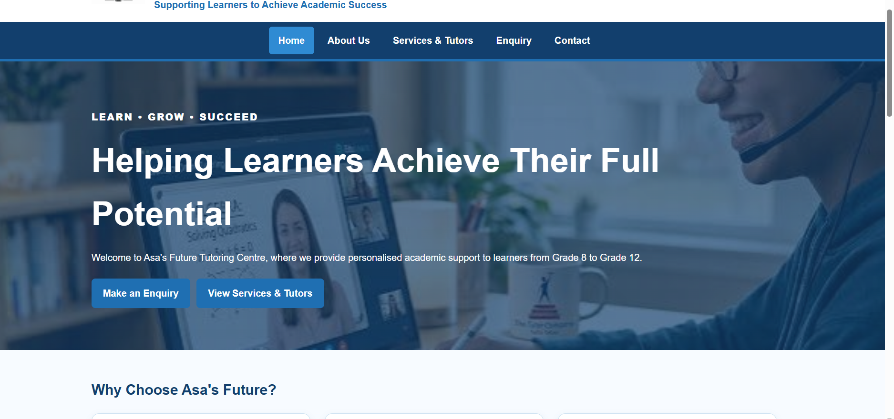
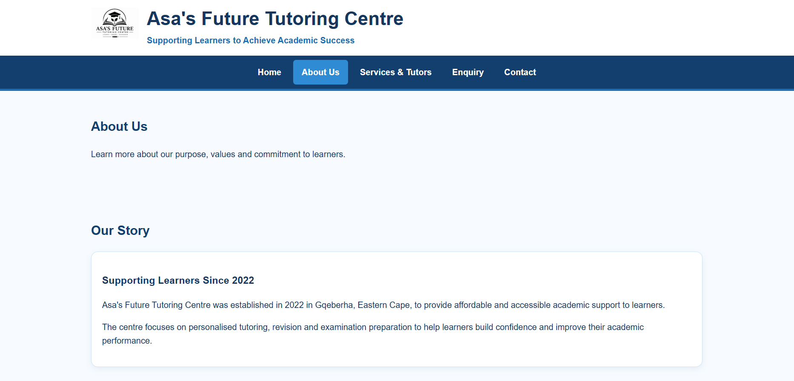
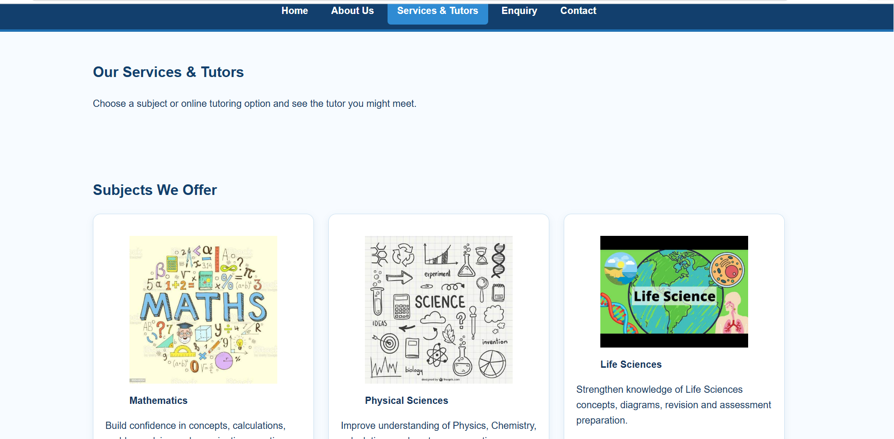
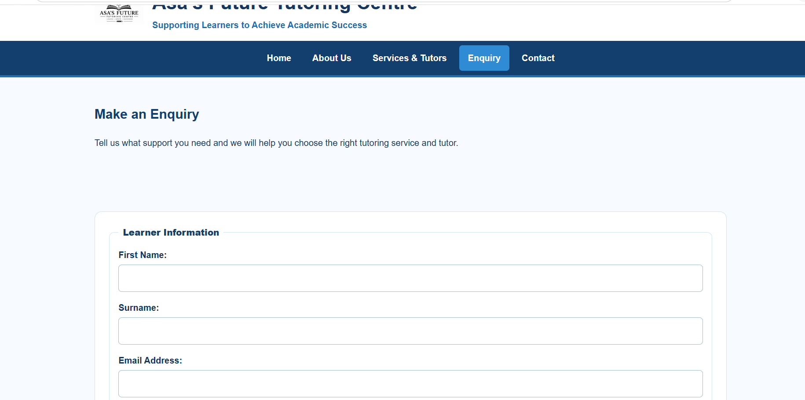
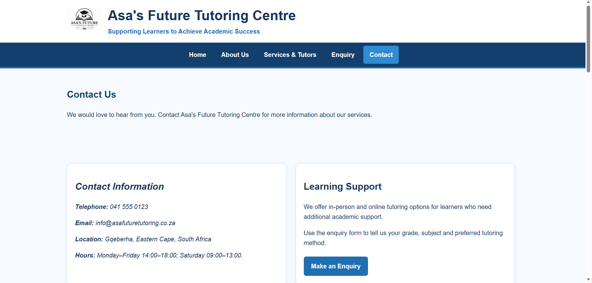

# ASA'S FUTURE TUTORING CENTRE

**Supporting Learners to Achieve Academic Success**

**LEARN • GROW • SUCCEED**

---

# 1. PROJECT OVERVIEW

Asa's Future Tutoring Centre is a fictional tutoring centre website developed as part of a web-development project.

The website was developed in two main parts:

* **Part 1 – HTML Website Development**
* **Part 2 – CSS Styling and Website Enhancement**

The purpose of the website is to provide learners and parents with information about the tutoring centre, academic subjects, tutoring services, online tutoring, enquiries and contact information.

The website demonstrates the practical use of HTML5, CSS3, website navigation, images, forms, responsive design, accessibility, Git, GitHub and GitHub Pages.

---

# PART 1 – HTML WEBSITE DEVELOPMENT

## 2. Part 1 Overview

Part 1 focused on creating the basic structure and content of the website using HTML5.

The website was divided into multiple pages so that users can navigate between different sections of information.

The main HTML requirements included:

* Creating a homepage.
* Creating multiple website pages.
* Creating navigation between pages.
* Adding headings and paragraphs.
* Adding images.
* Adding lists.
* Adding links.
* Creating forms.
* Adding labels to form controls.
* Organising content using semantic HTML elements.
* Creating a logical website structure.

---

## 3. Website Pages

The website contains the following pages:

| Page     | File                  | Purpose                                     |
| -------- | --------------------- | ------------------------------------------- |
| Home     | `index.html`          | Introduces the tutoring centre              |
| About Us | `pages/about.html`    | Provides information about the organisation |
| Services | `pages/services.html` | Displays tutoring services and subjects     |
| Enquiry  | `pages/enquiry.html`  | Allows users to submit an enquiry           |
| Contact  | `pages/contact.html`  | Provides contact and location information   |

The homepage is stored in the root directory, while the remaining pages are stored inside the `pages` directory.

---

## 4. Website Content

The website provides information about Asa's Future Tutoring Centre.

### Organisation Information

* Organisation name.
* Year established.
* Location.
* Purpose.
* Mission.
* Vision.
* Values.
* Contact information.

The organisation was established in 2022 in Gqeberha, Eastern Cape, South Africa.

The purpose of the organisation is to provide affordable and accessible academic support to learners.

---

## 5. Home Page

The homepage is stored as:

```text
index.html
```

The homepage provides an introduction to Asa's Future Tutoring Centre.

The homepage includes:

* Organisation logo.
* Organisation name.
* Tagline.
* Slogan.
* Introduction to the tutoring centre.
* Navigation menu.
* Links to the other website pages.
* Relevant images.
* Call-to-action information.

The homepage is located in the root directory because GitHub Pages uses `index.html` as the default page when the website root is opened.

---

## 6. About Us Page

The About Us page is stored as:

```text
pages/about.html
```

The page provides information about the organisation.

Content includes:

* Background information.
* Establishment in 2022.
* Location in Gqeberha.
* Purpose of the tutoring centre.
* Mission.
* Vision.
* Values.
* Supporting information about learners.

The page also includes relevant images.

---

## 7. Services Page

The Services page is stored as:

```text
pages/services.html
```

The Services page provides information about the academic support offered.

### Subjects

The website includes the following subjects:

* Mathematics
* Physical Sciences
* Life Sciences
* English
* Accounting
* Business Studies
* CAT

### Tutoring Services

The services include:

* Subject tutoring.
* Revision.
* Examination preparation.
* Personalised academic support.
* Online tutoring.

---

## 8. Enquiry Page

The Enquiry page is stored as:

```text
pages/enquiry.html
```

The enquiry page provides a form that allows learners or parents to submit an enquiry.

The form includes appropriate controls for collecting information from the user.

Examples of form controls include:

* Full name.
* Email address.
* Telephone number.
* Subject selection.
* Message or enquiry.
* Submit button.

Form labels are included to clearly identify the information that users are expected to enter.

Example:

```html
<label for="name">Full Name:</label>
<input type="text" id="name" name="name">
```

---

## 9. Contact Page

The Contact page is stored as:

```text
pages/contact.html
```

The Contact page provides ways for learners and parents to contact the tutoring centre.

The page includes:

* Telephone information.
* Social-media information.
* Facebook.
* Instagram.
* WhatsApp Business.
* Location information.
* Map.
* Contact form or contact information.

---

## 10. HTML Navigation

Navigation links were created so users can move between all website pages.

From the homepage, links to pages inside the `pages` folder use:

```html
<a href="pages/about.html">About Us</a>
<a href="pages/services.html">Services</a>
<a href="pages/enquiry.html">Enquiry</a>
<a href="pages/contact.html">Contact</a>
```

From a page inside the `pages` folder, the link back to the homepage uses:

```html
<a href="../index.html">Home</a>
```

The `../` moves from the `pages` folder back to the root directory.

---

## 11. HTML Images

Images are stored inside the `assets` folder.

Examples include:

```text
assets/
├── asa-future-tutoring-logo.png
├── mathematics.jpg
├── life-science.jpg
└── online-tutoring.jpg
```

From the homepage, an image is referenced using:

```html

```

From a page inside the `pages` folder:

```html

```

Alternative text is included with images to improve accessibility.

---

## 12. HTML Forms and Labels

Forms were included to allow users to provide information to the tutoring centre.

Form labels clearly identify the purpose of each input field.

Example:

```html
<label for="email">Email Address:</label>
<input type="email" id="email" name="email">
```

The label's `for` attribute matches the input's `id`.

This improves usability and accessibility.

---

## 13. Semantic HTML

Semantic HTML elements are used to organise the website content.

Examples include:

```html
<header>
<nav>
<main>
<section>
<article>
<footer>
```

These elements provide a logical structure and make the content easier to understand.

---

# PART 2 – CSS STYLING AND WEBSITE ENHANCEMENT

## 14. Part 2 Overview

Part 2 focused on improving the appearance, layout and usability of the website using CSS.

The CSS was used to create a consistent design across the website pages.

Part 2 included:

* External CSS.
* Page layout.
* Typography.
* Colours.
* Navigation styling.
* Images.
* Buttons.
* Forms.
* Cards and sections.
* Responsive design.
* Background images.
* Hover effects.
* Consistent spacing.
* Mobile-friendly layouts.

---

## 15. External CSS

The website uses an external stylesheet:

```text
css/style.css
```

The stylesheet is linked from the homepage using:

```html
<link rel="stylesheet" href="css/style.css">
```

Pages inside the `pages` folder use:

```html
<link rel="stylesheet" href="../css/style.css">
```

Using an external stylesheet allows the same design rules to be applied consistently across multiple pages.

---

## 16. Website Layout

CSS was used to control the layout of the website.

The layout includes:

* Header.
* Navigation.
* Main content.
* Sections.
* Images.
* Service cards.
* Forms.
* Footer.

The design aims to make information easy to find and understand.

---

## 17. Navigation Styling

CSS was used to style the navigation menu.

The navigation styling controls elements such as:

* Link appearance.
* Spacing.
* Alignment.
* Hover effects.
* Navigation layout.

The navigation remains consistent throughout the website.

---

## 18. Typography

CSS was used to control the appearance of text.

Styling includes:

* Font family.
* Font size.
* Font weight.
* Line height.
* Heading sizes.
* Paragraph spacing.
* Text alignment.

Different heading sizes are used to create a clear visual hierarchy.

---

## 19. Images and Background Images

CSS was used to control the presentation of images.

This includes:

* Image sizing.
* Image positioning.
* Image borders.
* Image spacing.
* Responsive image sizing.

A background image can also be used on the homepage to improve the visual appearance of the website.

The background image is controlled through the external stylesheet.

---

## 20. Service Cards

The Services page uses structured sections/cards to present tutoring services and academic subjects.

The cards help users quickly identify:

* Mathematics.
* Physical Sciences.
* Life Sciences.
* Online tutoring.

CSS controls the layout, spacing and appearance of these sections.

---

## 21. Forms Styling

CSS was used to improve the appearance and usability of the forms.

Form styling includes:

* Input fields.
* Text areas.
* Selection controls.
* Buttons.
* Labels.
* Spacing.
* Field widths.

The form layout is designed to remain usable on smaller screens.

---

## 22. Responsive Design

Responsive CSS was included so that the website can adapt to different screen sizes.

The website was designed to work on:

* Desktop computers.
* Laptops.
* Tablets.
* Mobile phones.

Responsive design helps prevent content from extending beyond the screen and improves usability on smaller devices.

CSS media queries can be used to change the layout for smaller screens.

Example:

```css
@media (max-width: 768px) {
    /* Mobile layout adjustments */
}
```

---

## 23. Accessibility

Accessibility principles were considered throughout the website.

Examples include:

* Descriptive image `alt` text.
* Clear form labels.
* Logical headings.
* Readable text.
* Clear navigation.
* Sufficient spacing.
* Usable form controls.

These features help make the website easier to use for a wider range of visitors.

---

# WEBSITE STRUCTURE

## 24. Final Folder Structure

The final project follows this structure:

```text
Asa-s_Future_Tutoring_Centre/
│
├── index.html
├── README.md
│
├── pages/
│   ├── about.html
│   ├── services.html
│   ├── enquiry.html
│   └── contact.html
│
├── assets/
│   ├── asa-future-tutoring-logo.png
│   ├── mathematics.jpg
│   ├── life-science.jpg
│   └── online-tutoring.jpg
│
└── css/
    └── style.css
```

All folder names use lowercase naming:

```text
pages
assets
css
```

This helps avoid path and case-sensitivity problems.

---

## 25. Site Hierarchy

The website follows this structure:

```text
                    ASA'S FUTURE TUTORING CENTRE
                              |
        ------------------------------------------------
        |          |          |          |             |
       HOME      ABOUT     SERVICES   ENQUIRY       CONTACT
        |          |          |          |             |
     index.html    |          |       Form fields   Contact details
                   |          |
              Organisation   Academic Subjects
              Information    |
              Mission        -------------------------
              Vision         |      |      |         |
              Values        Maths  Physical  Life    Online
                            Sciences Sciences Tutoring
```

---

# PROJECT MANAGEMENT

## 26. Git and GitHub

Git and GitHub were used during the development of the website.

### Git was used for:

* Tracking changes.
* Creating commits.
* Maintaining different versions of the project.
* Recording development progress.

### GitHub was used for:

* Hosting the repository.
* Storing the website files.
* Managing the source code.
* Publishing the website through GitHub Pages.

**Repository:** `Asa-s_Future_Tutoring_Centre`

**GitHub Account:** `Asamkelisiwe-Madikane`

---

## 27. Version Control

Commits were used to record important stages of development.

Examples of commits include:

* Created initial website structure.
* Added homepage.
* Added About Us page.
* Added Services page.
* Added Enquiry page.
* Added Contact page.
* Added images and assets.
* Added CSS stylesheet.
* Added responsive design.
* Added background image.
* Corrected navigation paths.
* Corrected image paths.
* Updated website content.
* Prepared website for GitHub Pages.

Using Git commits provides a record of the development process.

---

## 28. GitHub Pages

The website was prepared for deployment using GitHub Pages.

The homepage is located in the root directory:

```text
index.html
```

The remaining pages are located inside:

```text
pages/
```

The website is published at:

[Asa's Future Tutoring Centre – GitHub Pages](https://asamkelisiwe-madikane.github.io/asa-tutoring/)


The repository is intended to remain public so that the website can be accessed and assessed.

---

# WEBSITE FEATURES

## 29. Main Website Features

The completed website includes:

* Multi-page navigation.
* Organisation information.
* Academic subject information.
* Tutoring services.
* Online tutoring.
* Images.
* Logo.
* Forms.
* Form labels.
* Contact information.
* Social-media links.
* Map/location information.
* External CSS.
* Responsive design.
* Background imagery.
* Consistent page layout.
* Accessibility features.

---

## 30. Website Design Principles

The website was designed using the following principles.

### Consistency

The pages use a consistent navigation structure and visual design.

### Simplicity

Information is presented in a straightforward way.

### Accessibility

Images, forms, headings and navigation are designed to be accessible and understandable.

### Visual Hierarchy

Headings, sections and images help users identify important information.

### Usability

Navigation and forms are arranged so users can easily find information and provide enquiries.

### Responsiveness

The layout adapts to different screen sizes.

---

## 31. Project Challenges and Solutions

Several common website-development challenges were addressed during the project.

| Challenge                       | Solution                                           |
| ------------------------------- | -------------------------------------------------- |
| Homepage not loading            | Place `index.html` in the repository root          |
| Page links not working          | Use correct relative paths                         |
| Images not displaying           | Check the `assets/` folder and filenames           |
| CSS not loading                 | Check the stylesheet path                          |
| Different folder capitalisation | Use lowercase folder names consistently            |
| GitHub Pages 404 error          | Check repository structure and Pages configuration |
| Mobile layout problems          | Use responsive CSS                                 |
| Incorrect image paths           | Use the correct path based on page location        |
| Forms difficult to use          | Add clear labels and appropriate controls          |

---

# TECHNOLOGIES

## 32. Technologies Used

| Technology   | Purpose                         |
| ------------ | ------------------------------- |
| HTML5        | Website structure and content   |
| CSS          | Website styling and layout      |
| Git          | Version control                 |
| GitHub       | Repository hosting              |
| GitHub Pages | Website deployment              |
| Web Browser  | Website development and viewing |

---

# PROJECT OUTCOME

## 33. Project Outcome

The completed project provides a structured website for the fictional Asa's Future Tutoring Centre.

The website demonstrates the practical application of:

* HTML5.
* CSS3.
* Website structure.
* Navigation.
* Images.
* Forms.
* Form labels.
* Accessibility.
* Responsive design.
* Background images.
* Website styling.
* Version control.
* GitHub.
* GitHub Pages.

The website provides learners and parents with information about the organisation, academic subjects, tutoring services, online tutoring, enquiries and contact options.

# ✅ CHANGELOG
## Changelog (Updates Made)
- ✅ Added additional documentation details from **Part 1** into this ReadMe.
- ✅ Improved the use of **semantic HTML elements** documentation by explicitly outlining semantic structure practices in the Part 1 section.
- ✅ Enhanced clarity of **Part 1 feature explanations**, while keeping the rest of the ReadMe unchanged.
- ✅ Added a clearer **changelog heading** describing the updates made.
---
# Screenshots of how every page looks:





---

# REFERENCES

## 34. References

The following resources were consulted for general web-development information and technical guidance.

### HTML

Mozilla Developer Network (MDN). 2026. *HTML: HyperText Markup Language*. Available at:

[MDN HTML Documentation](https://developer.mozilla.org/en-US/docs/Web/HTML)

Accessed: 15 September 2026.

### CSS

Mozilla Developer Network (MDN). 2026. *CSS: Cascading Style Sheets*. Available at:

[MDN CSS Documentation](https://developer.mozilla.org/en-US/docs/Web/CSS)

Accessed: 15 September 2026.

### Web Accessibility

World Wide Web Consortium (W3C). 2026. *Web Accessibility Initiative*. Available at:

[W3C Web Accessibility Initiative](https://www.w3.org/WAI)

Accessed: 15 September 2026.

### GitHub

GitHub. 2026. *GitHub Documentation*. Available at:

[GitHub Documentation](https://github.com/Asamkelisiwe-Madikane/asa-tutoring)

Accessed: 15 September 2026.


Accessed: 15 September 2026.

### HTML Validation

World Wide Web Consortium (W3C). 2026. *Markup Validation Service*. Available at:

[W3C Markup Validation Service](https://validator.w3.org)

Accessed: 15 September 2026.

### CSS Validation

World Wide Web Consortium (W3C). 2026. *CSS Validation Service*. Available at:

[W3C CSS Validation Service](https://jigsaw.w3.org/css-validator)

Accessed: 15 September 2026.

---

# AUTHOR INFORMATION

## 35. Author

**Student:** Asamkelisiwe Madikane

**Student Number:** ST10519703

**Project:** Asa's Future Tutoring Centre

**Year:** 2026

**Slogan:** LEARN • GROW • SUCCEED

**Tagline:** Supporting Learners to Achieve Academic Success
